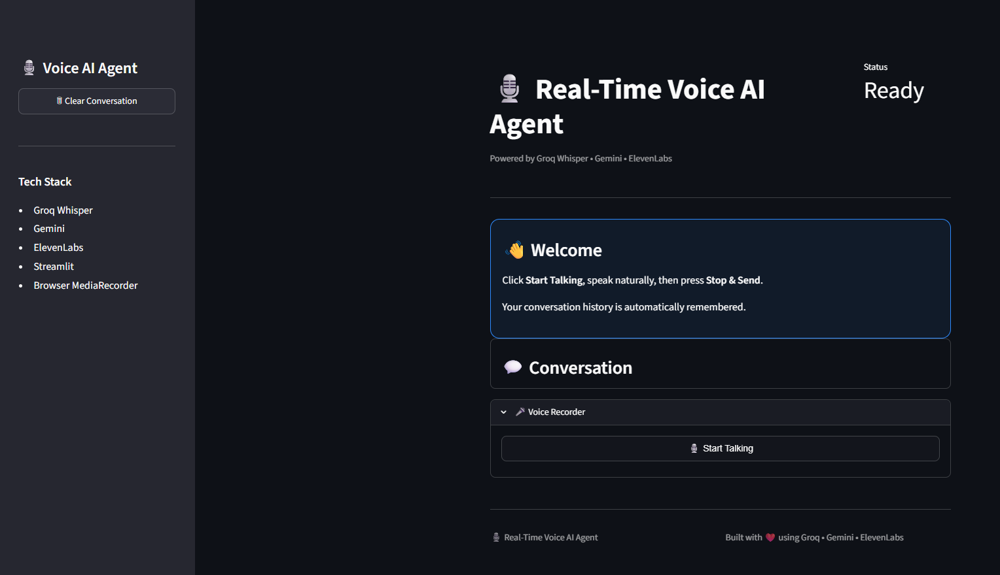
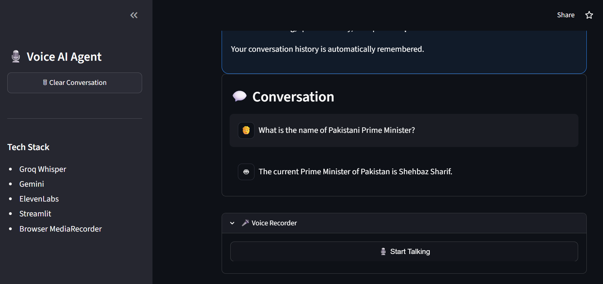

<div align="center">

# 🎙️ Real-Time Voice AI Agent

### Speak Naturally. Think Instantly. Respond with AI Voice.

A production-ready conversational Voice AI Agent built with **Groq Whisper**, **Google Gemini**, **ElevenLabs**, and **Streamlit**.

Unlike traditional speech-to-text demos, this project enables **real-time multi-turn voice conversations** with memory, automatic speech synthesis, and an interactive browser-based experience.

---

[]()
[]()
[]()
[]()
[]()

</div>

---

# ✨ Demo

> 📹 **Demo Video**

https://github.com/user-attachments/assets/83d3f79b-4af8-44c1-9157-127a1105f48f

---

# 🚀 Features

- 🎤 Browser microphone recording
- ⚡ Groq Whisper speech-to-text
- 🧠 Google Gemini conversational reasoning
- 🔊 ElevenLabs natural voice synthesis
- 💬 Multi-turn conversation memory
- 🎧 Automatic audio playback
- 🌐 Browser-based recording (no local microphone libraries)
- 📱 Streamlit Cloud compatible
- 🔄 Continuous voice interaction
- 🧹 Clear conversation support
- ⚠️ Robust error handling

---

# 🖼️ Application Preview

> Add screenshots here.

## Home Screen



---

## Voice Conversation



---

# 🏗️ System Architecture

```text
            🎤 User Voice
                   │
                   ▼
        Browser Microphone
                   │
                   ▼
      streamlit-mic-recorder
                   │
                   ▼
          Audio Recorder
                   │
                   ▼
         Groq Whisper API
       (Speech → Text)
                   │
                   ▼
          Google Gemini
      (Reasoning & Response)
                   │
                   ▼
       ElevenLabs Text-to-Speech
                   │
                   ▼
        Auto Audio Playback
                   │
                   ▼
             👤 User
```

---

# ⚙️ Tech Stack

| Category | Technology |
|----------|------------|
| Language | Python |
| Frontend | Streamlit |
| Speech Recognition | Groq Whisper |
| LLM | Google Gemini |
| Text-to-Speech | ElevenLabs |
| Recording | streamlit-mic-recorder |
| Configuration | python-dotenv |

---

# 📂 Project Structure

```text
Real-Time-Voice-AI-Agent/
│
├── agent/
│   ├── __init__.py
│   ├── conversation.py
│   ├── prompts.py
│   └── voice_agent.py
│
├── asr/
│   ├── __init__.py
│   ├── base.py
│   └── groq_asr.py
│
├── audio/
│   ├── __init__.py
│   ├── audio_utils.py
│   ├── player.py
│   └── recorder.py
│
├── llm/
│   ├── __init__.py
│   ├── base.py
│   └── gemini_llm.py
│
├── models/
│   ├── __init__.py
│   └── voice_response.py
│
├── tts/
│   ├── __init__.py
│   ├── base.py
│   └── elevenlabs_tts.py
│
├── utils/
│   ├── __init__.py
│   ├── audio_player.py
│   ├── exceptions.py
│   ├── file_handler.py
│   └── logger.py
│
├── recordings/
├── responses/
│
├── .streamlit/
│   └── config.toml
│
├── app.py
├── config.py
├── requirements.txt
├── README.md
├── .env.example
└── .gitignore
```

---

# 🔄 Conversation Pipeline

```text
User Speaks
      │
      ▼
Browser Recorder
      │
      ▼
Groq Whisper
      │
      ▼
Gemini
      │
      ▼
ElevenLabs
      │
      ▼
Audio Auto Plays
      │
      ▼
Ready for Next Conversation
```

---

# ⚡ Installation

Clone the repository

```bash
git clone https://github.com/yourusername/Real-Time-Voice-AI-Agent.git
```

Move into the project

```bash
cd Real-Time-Voice-AI-Agent
```

Create a virtual environment

```bash
python -m venv venv
```

Activate it

Windows

```bash
venv\Scripts\activate
```

Linux / macOS

```bash
source venv/bin/activate
```

Install dependencies

```bash
pip install -r requirements.txt
```

---

# 🔑 Environment Variables

Create a `.env`

```env
GROQ_API_KEY=

GEMINI_API_KEY=

ELEVENLABS_API_KEY=

VOICE_ID=

```

---

# ▶️ Run Locally

```bash
streamlit run app.py
```

---

# 🌍 Deployment

The application is fully compatible with:

- ✅ Streamlit Community Cloud
- ✅ Local Development

---

# 🎯 Challenges Solved

During development, several engineering challenges were addressed:

- Browser-based microphone integration
- Continuous multi-turn conversations
- Audio auto-play without manual interaction
- Conversation memory management
- Eliminating duplicate processing
- Cloud-compatible voice recording
- Clean modular architecture


---

# 🤝 Contributing

Contributions, issues, and feature requests are welcome.

Feel free to open an issue or submit a pull request.

---

# 📄 License

This project is released under the MIT License.

---

<div align="center">

### ⭐ If you found this project useful, consider giving it a star!

</div>